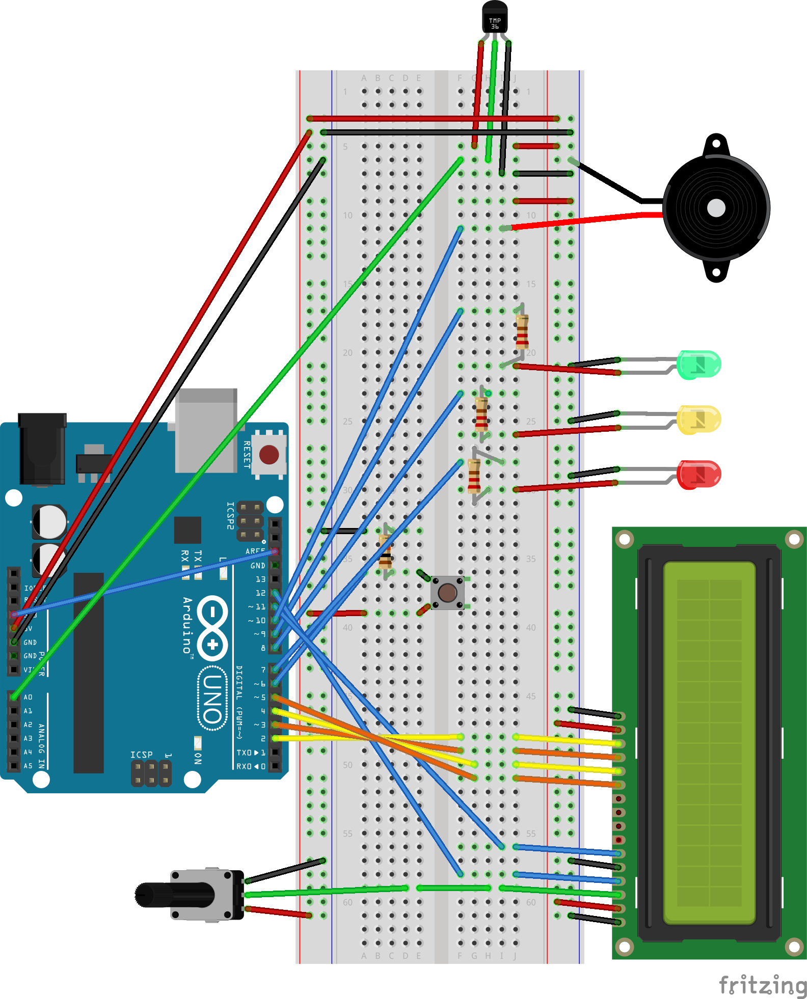

TERMOMETRO CON ARDUINO
======================
Questo progetto è pensato per misuralre la temperatura all'interno di una scatola chiusa con all'interno 3 Raspberry Pi
e alcuni alimentatori attivi.
- - - - - - - - - - - -

#### Schema elettrico

